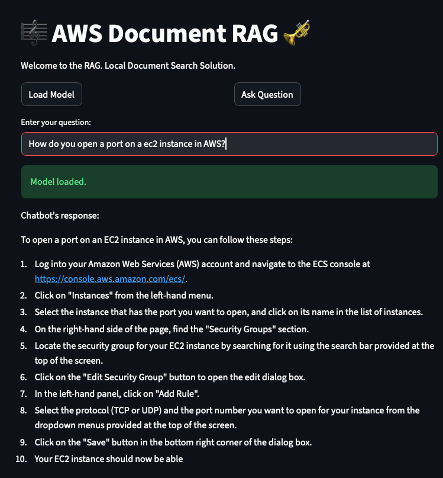

# AWS Documentation RAG Assistant

An AI-powered Retrieval-Augmented Generation (RAG) chatbot built for answering technical AWS questions using
live documentation embeddings and semantic search.
## Live Demo

The latest version of this project has been moved to a new GitHub repo and is currently live on Render
The v0 version of this app has been taken down due to memory constraints but it can is still available on docker hub. 

- v0 Dockerhub Deployment: [AWS-Documentation-Rag](https://hub.docker.com/repository/docker/daniellevenstein/aws-documentation-rag/general)
- v1 GitHub Source:  [DanielLevenstein/AWS-Certification-Coach](https://github.com/DanielLevenstein/AWS-Certification-Coach)
- v1 Render Deployment: [AWS Certification Coach](https://aws-certification-coach-latest.onrender.com/)

  
# Application Screenshot (V0)



*Figure: The RAG chatbot answers an Amazon S3 question using context retrieved from AWS documentation.*

## Why I Built This

I built this project to explore how Retrieval-Augmented Generation can reduce hallucinations in technical Q&A systems
by grounding responses in AWS documentation. The goal was to create a lightweight proof of concept that crawls selected
AWS docs, builds a semantic search index, and uses retrieved context to answer infrastructure-related questions.

## System Description

The system crawls selected AWS documentation pages, processes and chunks the content, generates vector embeddings,
and stores them in a FAISS index for fast retrieval. When a user submits a question, the chatbot retrieves the
most relevant documentation fragments and uses them as grounded context for response generation.

### System Requirements

AWS Documentation RAG Assistant uses Python 3.11 and runs on port 8501.

## Models Used


| Models Used                        | Model Size | Version  |
| ---------------------------------- | ---------- | -------- |
| tinyllama-1.1b-chat-v1.0.Q2_K.gguf | 483 MB     | v0.1.0   |
| all-MiniLM-L6-v2                   | 91 MB      | v0.0.1 + |

## Major Releases


| Version | Image Size | Change                                          |
| ------- | ---------- | ----------------------------------------------- |
| v0.0.1  | 15.8 GB    | First working build on Render                   |
| v0.1.1  | 2.97 GB    | Implemented lazy loading (not merged)           |
| v0.2.0  | 2.97 GB    | Implemented context-aware chunking              |
| v0.2.7  | 1.22 GB    | CPU-only torch and production timing logs       |
| v0.3.0  | 3.54 GB    | Restored lazy model loading UI                  |
| v0.3.1  | 1.19 GB    | Split README from release log for smaller image |

### Optimization Work

The project went through several deployment optimization passes, reducing the Docker image from 15.8 GB in the first
working build to approximately 1.19 GB by splitting logs, dependencies, and README/release documentation.

## Current AWS Coverage

```
["cloudformation", "cloudwatch", "elasticloadbalancing",
   "ec2", "ecs", "eks", "iam", "lambda", "rds", "s3", "vpc"]

```

### Example Queries

- "How do I configure an Application Load Balancer for ECS?"
- "What permissions are required for Lambda to access S3?"

### Key Learnings

- Docker image size has a major impact on deployment speed and cold-start behavior.
- Embedding/index consistency is critical for reliable retrieval.
- Context-aware chunking improves the quality of retrieved documentation.
- Small local LLMs can run in constrained environments, but latency and answer quality require careful tradeoffs.

## Coming Next: AWS Certification Coach

For my next project, I will be creating an AI study partner for AWS certification exams.

This lightweight app will help people study for AWS certifications by generating freeform questions from an existing
practice test, evaluating the correctness of each answer, and using an LLM to provide personalized feedback for better
retention.

Unlike this version, this architecture will avoid Retrieval-Augmented Generation (RAG), vector databases, and FAISS
indexes in favor of a simpler question-and-evaluation workflow.

The next version of this app is currently live at render.com.
https://aws-certification-coach-latest.onrender.com/

## Running in Docker

Latest prebuilt image:

```bash
docker run -p 8501:8501 --rm daniellevenstein/aws-documentation-rag:latest
```

## Running Locally

This project includes a local Streamlit app for testing. For ease of testing, the `extract.py` and `ingest.py` scripts
have already been run, and the generated chunks and indexes have been committed to source control.

To run the Streamlit app, install the dependencies and start the app locally:

```bash
pip install -r requirements.txt
streamlit run app.py
```

Then open `http://localhost:8501` on the host machine.

Note: inside a Docker container, `localhost` means that same container. If another container needs to reach this app,
put both containers on the same Docker network and use the app container name, or use `host.docker.internal:8501` to
reach a service running on the host.

## Architecture Overview

1. Documentation Crawling

   - Scrapes AWS documentation pages
   - Limits recursive traversal depth to control corpus size
   - Filters and normalizes extracted content
2. Document Processing

   - Cleans HTML and removes navigation noise
   - Splits documentation into searchable chunks
   - Preserves contextual structure where possible
3. Embedding & Indexing

   - Generates vector embeddings for document chunks
   - Stores embeddings in a FAISS vector index
   - Enables low-latency semantic similarity search
4. Retrieval-Augmented Generation

   - Retrieves relevant documentation chunks for each query
   - Injects retrieved context into the LLM prompt
   - Produces grounded technical responses based on AWS documentation

## Goals

- Reduce hallucinations in AWS-related answers
- Provide context-aware technical support
- Enable fast semantic search across AWS services
- Serve as a lightweight proof-of-concept RAG architecture

## Tech Stack

- Python
- BeautifulSoup
- Requests
- FAISS
- Embedding Models
- Large Language Models (LLMs)

## Status

This project is currently a proof of concept focused on validating:

- constrained documentation crawling
- semantic retrieval quality
- FAISS-based vector search
- AWS-focused RAG workflows

### Notes

- Make sure the embedding model used during ingestion matches the model used for querying (default: `all-MiniLM-L6-v2`).
- FAISS indexes and chunks must remain aligned. Do not modify the pickled chunks file manually.
- All scripts have to be run from the root directory of the project.

## Extract Documentation

- Copy `config/features_default.json` to `config/features_current.json`
- Run `extract.py` to extract documentation

This process will scrape AWS documentation for features listed in `features_current.json` and save raw file content to
the data directory.

## Creating Indexes

- Run `ingest.py` to create new indexes

This process will build a FAISS index from downloaded data and save the chunks and index in the `index/` folder.

### Output

- `index/index.faiss` - FAISS vector index
- `index/chunks.pkl` - Pickled text chunks
